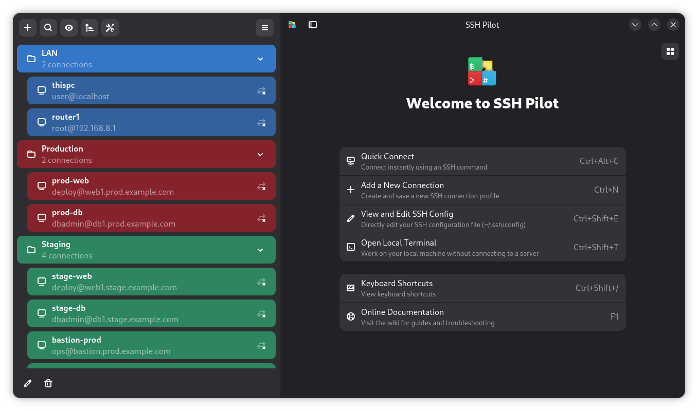

<p align="center">

</p>


**SSH Pilot** is a user-friendly, modern and lightweight SSH connection manager for Linux and macOS, with an integrated terminal. 


<table>
  <tr>
    <td align="center" valign="top">
      <br><strong>Start Page</strong>
    </td>
    <td align="center" valign="top">
      <br><strong>Main Window with Tabs</strong>
    </td>
    <td align="center" valign="top">
      <br><strong>Tab Overview</strong>
    </td>
  </tr>
  <tr>
    <td></td> <!-- empty cell left -->
    <td align="center" valign="top">
      <br><strong>SSH Copy ID</strong>
    </td>
    <td></td> <!-- empty cell right -->
  </tr>
</table>


## Features

- Tabbed interface
- Intuitive, minimal UI with keyboard navigation and shortcuts
- File management using SFTP
- Organize servers in groups
- Option to use the built-in terminal or your favorite one
- Broadcast commands to all open tabs
- Full support for Local, Remote and Dynamic port forwarding 
- SCP support for quickly uploading or downloading files to/from remote servers
- Keypair generation and copying to remote servers (ssh-copy-id)
- Support for running remote and local commands upon login
- Secure storage for credentials via libsecret on Linux; no secret (password or passphrase) is copied to clipboard or saved to plain text
- Privacy toggle to show/hide ip addresses/hostnames in the main window
- Light/Dark interface themes
- Customizable terminal font and color schemes
- Load/save standard .ssh/config entries (Or use dedicated configuration file)
- Free software (GPL v3 license)


## Download

- ### DEB/RPM
Latest release can be downloaded from here: https://github.com/mfat/sshpilot/releases/

- ### Flatpak
Available on [Flathub](https://flathub.org/en/apps/io.github.mfat.sshpilot)

<p align="center">
<a href='https://flathub.org/apps/io.github.mfat.sshpilot'>
    
  </a>
</p>

OR in a terminal typ: 

`
flatpak install flathub io.github.mfat.sshpilot
`

Please see the relevant [wiki entry](https://github.com/mfat/sshpilot/wiki/Flatpak) for more information on the Flatpak. 

- ### Arch linux
Arch linux package via AUR: https://aur.archlinux.org/packages/sshpilot

- ### macOS (aarch64)
Download the dmg file from the releases section https://github.com/mfat/sshpilot/releases/

- ### Run from source
You can also run the app from source. Install the modules listed in requirements.txt and a fairly recent version of GNOME and it should run.

`
python3 run.py
`

To enable verbose debugging output, run the app with the `--verbose` flag:

`
python3 run.py --verbose
`


Runtime dependencies
--------------------

Install system GTK/libadwaita/VTE GI bindings (do not use pip for these).

Debian/Ubuntu (minimum versions)

```
sudo apt update
sudo apt install \
  python3 python3-gi python3-gi-cairo \
  libgtk-4-1 (>= 4.6) gir1.2-gtk-4.0 (>= 4.6) \
  libadwaita-1-0 (>= 1.4) gir1.2-adw-1 (>= 1.4) \
  libvte-2.91-gtk4-0 (>= 0.70) gir1.2-vte-3.91 (>= 0.70) \
  libsecret-1-0 gir1.2-secret-1 \
  python3-paramiko python3-cryptography sshpass ssh-askpass
```

Fedora / RHEL / CentOS


```
sudo dnf install \
  python3 python3-gobject \
  gtk4 libadwaita \
  vte291-gtk4 \
  libsecret \
  python3-paramiko python3-cryptography sshpass openssh-askpass
```

libsecret handles secure credential storage on Linux via the Secret Service API.

Run from source


```
python3 run.py
```

Enable verbose debugging with:

```
python3 run.py --verbose
```

Optional terminal backends
--------------------------

The default terminal uses the native VTE widget. To enable the optional
PyXterm.js backend install the extra dependency bundle:

```
pip install "sshpilot[pyxterm]"
```

or install `pyxtermjs` manually if you prefer:

```
pip install pyxtermjs
```

### Telegram channel
https://t.me/sshpilot

## Special Thanks

- [Elibugy](https://www.linkedin.com/in/elham-hesaraki) as the primary sponsor of the project
- Behnam Tavakkoli, Chalist and Kalpase, Ramin Najjarbashi, Farid and Narbeh for testing
- Icon designed by [Blisterexe](https://github.com/Blisterexe)

## Support development
Bitcoin: bc1qqtsyf0ft85zshsnw25jgsxnqy45rfa867zqk4t

Doge: DRzNb8DycFD65H6oHNLuzyTzY1S5avPHHx
