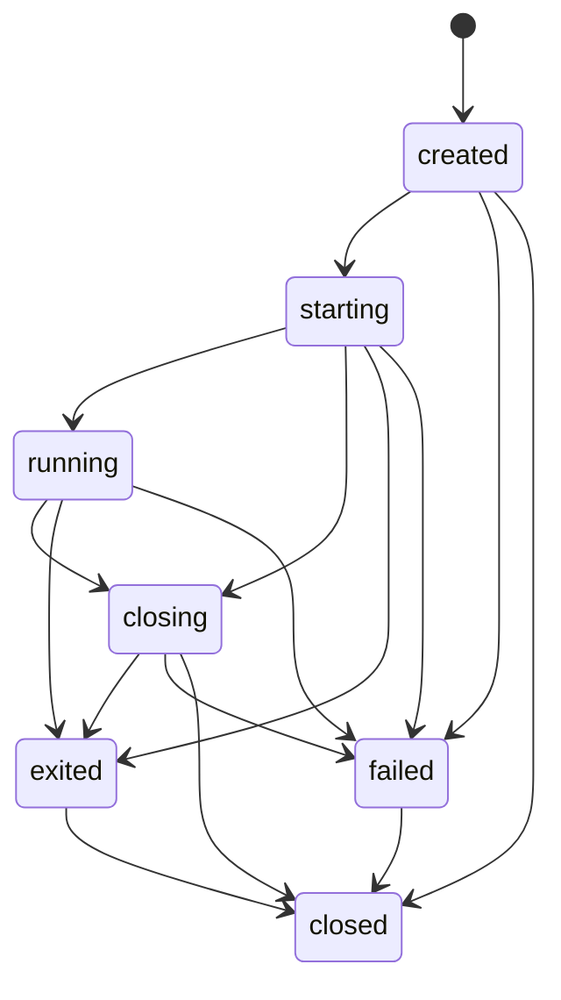
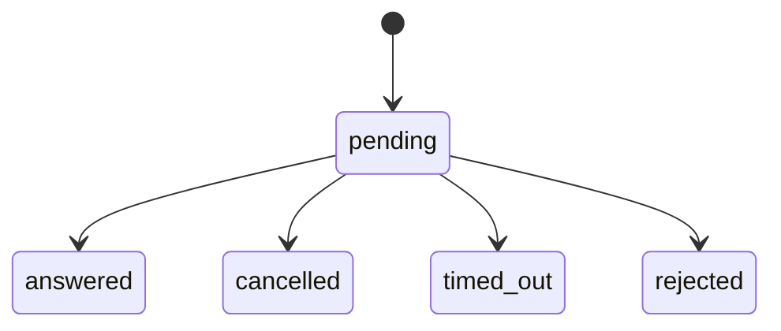
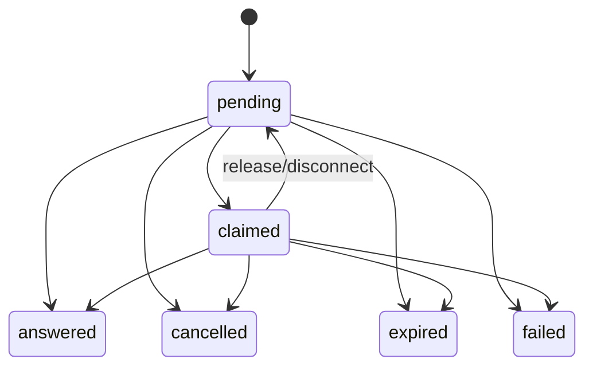
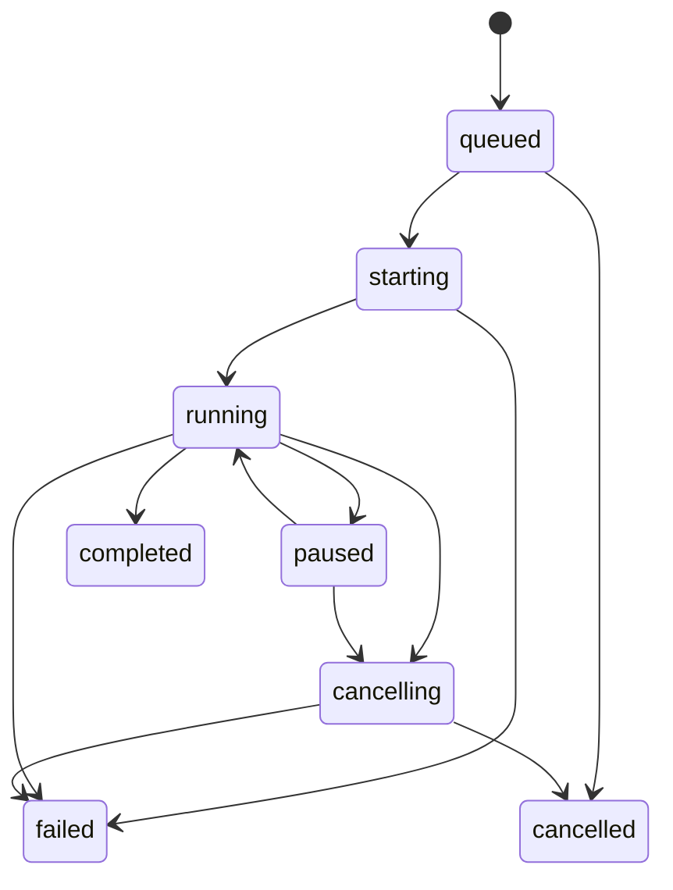
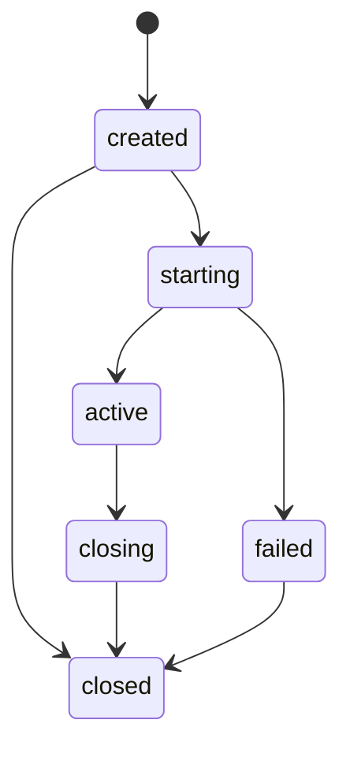

# State models

The public state domains are deliberately separate. None of the schema-only
diagrams below asserts that current GTK terminal state has moved into the API.

<!-- api-state: ConnectionHealth -->
## Connection health: `ConnectionHealth`

| State | Meaning | Runtime status |
| --- | --- | --- |
| `unknown` | No frontend-neutral health result exists | Implemented output; all current DTOs use it |
| `checking` | A future health check is in progress | Schema only |
| `reachable` | A future check found the host reachable | Schema only |
| `unreachable` | A future check could not reach the host | Schema only |

There is no runtime health monitor, transition engine, persistence, event, or
reconnection behaviour. `InProcessClient` intentionally does not map legacy
terminal-derived `ConnectionState` into health. A future monitor may define
`connection.health_changed`; that event does not exist today.

<!-- api-state: SessionState -->
## Runtime session lifecycle: `SessionState`

The daemon `SessionRuntime` enforces this lifecycle. Records are in-memory and
survive frontend disconnect, but are not persisted across daemon restart.

The table is normative and contract-tested. `closed` is final; no transition
returns to `running`. Invalid internal transitions are programming errors.
Frontend requests against absent/final records use structured public errors.
Repeated close is idempotent. `session.created`, `session.state_changed`,
`session.exited`, and `session.closed` each represent at most one accepted
transition. Process exit information is separate from safe startup failure
metadata. There is no reconnect, replay, prompt, PTY, or terminal-byte state.

<!-- api-state: InteractionStatus -->
## Legacy interaction schema: `InteractionStatus`

The legacy broad request/response models remain schema-only. Runtime Phase 8
uses the narrower `InteractionState` machine below.

`answered`, `cancelled`, `timed_out`, and `rejected` are intended terminal.

<!-- api-state: InteractionState -->
## Runtime typed interaction lifecycle: `InteractionState`

`answered`, `cancelled`, `expired`, and `failed` are final. The daemon broker
serializes claim/response/timeout/cancel races; exactly one result wins. A
responder disconnect before answer releases the claim. Session close, process
exit, and daemon shutdown cancel linked active interactions. Completed safe
metadata is retained under a bounded count; secrets are never retained in the
public state.

<!-- api-state: TransferState -->
## Transfer lifecycle: `TransferState`

The daemon `TransferRuntime` uses `queued`, `starting`, `running`, `paused`,
`cancelling`, `cancelled`, `completed`, and `failed`. `completed`, `failed`,
and `cancelled` are terminal. Binary streaming mode remains unimplemented;
Phase 10 transfers use daemon-path local mode only.

<!-- api-state: ForwardState -->
## Port-forward lifecycle: `ForwardState`

The daemon `ForwardRuntime` uses `created`, `starting`, `active`, `closing`,
`closed`, and `failed`. Legacy schema values `stopping`/`stopped` remain in the
enum for older readers but are not emitted by the Phase 10 runtime.
`closed` and `failed` are terminal for practical clients; failed records may
still be closed for cleanup.

## Duplicate state concepts

The legacy `connection_manager.ConnectionState` values
`unknown/connecting/connected/disconnected/failed` describe aggregate terminal
lifecycle in current GTK code. They are not `ConnectionHealth` and are not the
Protocol v1 `SessionState`. Likewise, the current `SessionManager` persists tab
layouts, not runtime sessions. These naming overlaps are migration debt and
must not be collapsed by adapters.
