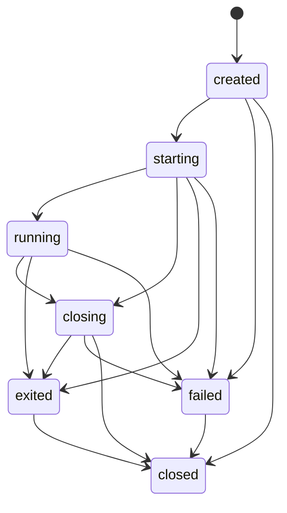
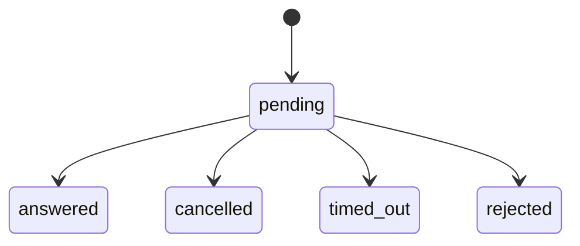
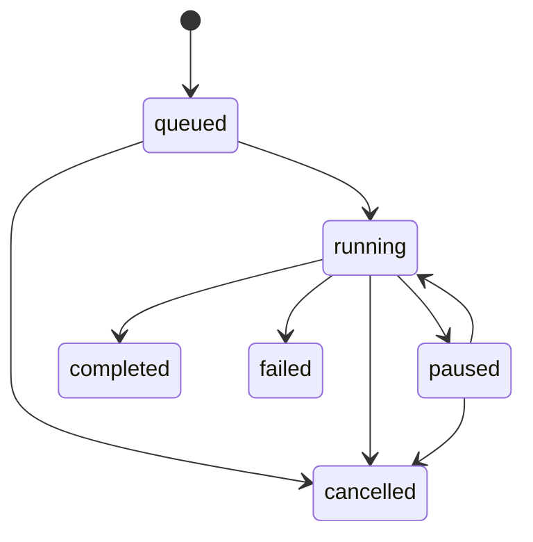
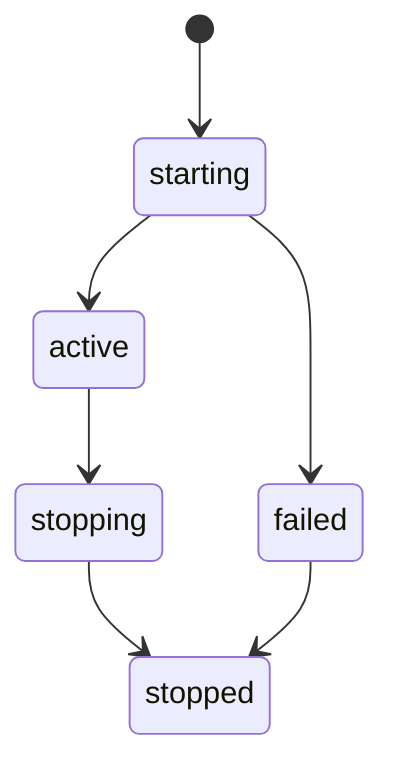

# State models

The public state domains are deliberately separate. None of the schema-only
diagrams below asserts that current GTK terminal state has moved into the API.

<!-- api-state: ConnectionHealth -->
## Connection health: `ConnectionHealth`

| State | Meaning | Runtime status |
| --- | --- | --- |
| `unknown` | No frontend-neutral health result exists | Implemented output; all current DTOs use it |
| `checking` | A future health check is in progress | Schema only |
| `reachable` | A future check found the host reachable | Schema only |
| `unreachable` | A future check could not reach the host | Schema only |

There is no runtime health monitor, transition engine, persistence, event, or
reconnection behaviour. `InProcessClient` intentionally does not map legacy
terminal-derived `ConnectionState` into health. A future monitor may define
`connection.health_changed`; that event does not exist today.

<!-- api-state: SessionState -->
## Runtime session lifecycle: `SessionState`

The daemon `SessionRuntime` enforces this lifecycle. Records are in-memory and
survive frontend disconnect, but are not persisted across daemon restart.

The table is normative and contract-tested. `closed` is final; no transition
returns to `running`. Invalid internal transitions are programming errors.
Frontend requests against absent/final records use structured public errors.
Repeated close is idempotent. `session.created`, `session.state_changed`,
`session.exited`, and `session.closed` each represent at most one accepted
transition. Process exit information is separate from safe startup failure
metadata. There is no reconnect, replay, prompt, PTY, or terminal-byte state.

<!-- api-state: InteractionStatus -->
## Interaction lifecycle: `InteractionStatus`

Construction validation currently enforces only:

- `InteractionRequest` starts as `pending`.
- `InteractionResponse` cannot be `pending`.
- A response that is not `answered` cannot include answer data.

`answered`, `cancelled`, `timed_out`, and `rejected` are intended terminal.
There is no runtime store, ownership, timeout scheduler, persistence, duplicate
answer detection, or event delivery. The
`interaction_already_answered`/`interaction_not_found` codes are schema only.

<!-- api-state: TransferState -->
## Transfer lifecycle: `TransferState`

The enum contains `queued`, `running`, `paused`, `completed`, `failed`, and
`cancelled`. All are schema only. The model does not enforce transitions.
`completed`, `failed`, and `cancelled` are intended terminal; pause/resume,
retry, persistence, and progress-event behaviour are undefined.

This is future design guidance, not current runtime behaviour.

<!-- api-state: ForwardState -->
## Port-forward lifecycle: `ForwardState`

The enum contains `starting`, `active`, `failed`, `stopping`, and `stopped`.
All are schema only and no method or event exposes them.

This intended shape is non-normative until a core owner and contract tests
exist. `stopped` is intended terminal.

## Duplicate state concepts

The legacy `connection_manager.ConnectionState` values
`unknown/connecting/connected/disconnected/failed` describe aggregate terminal
lifecycle in current GTK code. They are not `ConnectionHealth` and are not the
Protocol v1 `SessionState`. Likewise, the current `SessionManager` persists tab
layouts, not runtime sessions. These naming overlaps are migration debt and
must not be collapsed by adapters.
